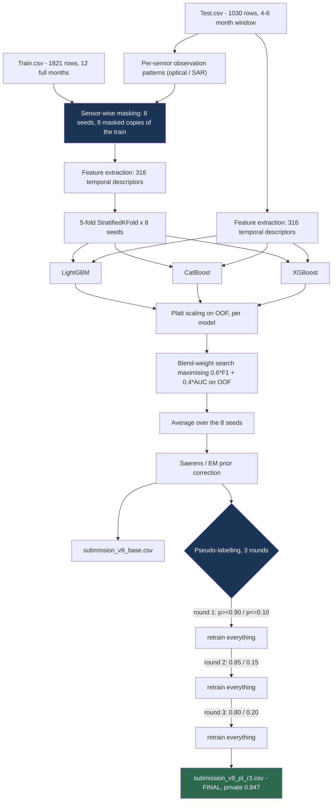

# Aquaculture Pond Identification — Solution Documentation

**Final result: 3rd place. Private score 0.947, public score 0.942367202.**


---

## 1. Overview and objectives

### The task

Given a multi-band satellite time series for a single 10 m × 10 m ground patch,
decide whether that patch is an **aquaculture pond**. Aquaculture mapping matters
because ponds are a fast-growing land use with real consequences for coastal
ecosystems, water quality and food security, and they are largely invisible to
land-cover products built for coarser classes.

Each row carries **12 monthly composites × 12 bands** — 10 optical Sentinel-2
(`blue green red nir nira re1 re2 re3 swir1 swir2`) and 2 radar Sentinel-1
(`VH VV`) — with `-9999` as the missing-value sentinel.

| file | rows | columns | observed months |
|---|---|---|---|
| `Train.csv` | 1 821 | 146 (ID + label + 144 measurements) | **12 of 12, always** |
| `Test.csv`  | 1 030 | 145 (ID + 144 measurements) | **4, 5 or 6 consecutive** |

The positive rate in the training set is **0.4036**.

### The metric

Two independently scored columns:

```
score = 0.6 × F1(TargetF1) + 0.4 × ROC-AUC(TargetRAUC)
```

`TargetF1` is a binary label, `TargetRAUC` a probability. The competition rules
state that **setting a probability threshold is strictly forbidden — the binary
target must use the default 0.5 threshold**. Our submission satisfies this
exactly: `TargetF1 == (TargetRAUC >= 0.5)` on every row, which yields 580
positives out of 1 030.

### The solution in one paragraph

A **CPU-only, three-model gradient-boosting ensemble over 316 hand-engineered
temporal descriptors**, wrapped in the two mechanisms that address what actually
makes this problem hard: a **sensor-wise masking simulation** that makes the
12-month training rows look like 4–6-month test rows, and **three rounds of
pseudo-labelling** that adapt the model to the test acquisition. No deep
learning, no external data, no GPU. Runs end to end in **3 h 15 min**.

### Expected outcome and observed outcome

| | public (~309 rows) | private (721 rows) |
|---|---|---|
| `submission_v9_pl_r3.csv` | 0.942367202 | **0.947** |

Decomposed on the public subset: **AUC 0.969432, F1 0.924324**.
The private score came out *above* the public one, which is the behaviour we
wanted from a solution built to generalise rather than to fit the public split.

---

## 2. Architecture diagram



---

## 3. ETL process

### Extract

Two CSV files supplied by the competition; **no external data of any kind** was
used. Loading is a plain `pandas.read_csv`. `-9999` is replaced by `NaN`
immediately (`df.replace(-9999, np.nan)`), because it is a missingness sentinel
and not a measurement — leaving it in place would let a tree split on it as if it
were a reflectance value.

Missingness is **not uniform across sensors**. Building the per-sensor masks from
`Test.csv` shows:

* 4 827 month × row cells where both sensors are present,
* **320 cells where the radar is present but the optics are missing** (cloud).

That second number drives a design decision in the transform stage.

### Transform

**a) Per-sensor observation patterns.** For every test row we record two boolean
vectors of length 12 — is the optical stack present this month, is the radar
stack present this month. These are the real acquisition patterns; they are not
modelled or approximated.

**b) Masking the training set (`mask_train_like_test`).** Every training row is
assigned one randomly drawn *real* test pattern and has the corresponding optical
and radar columns set to `NaN`, **independently per sensor**. A training row
therefore ends up with 4–6 observed months, some of which may be radar-only, in
exactly the proportion the test set exhibits. Verification:

| | train after masking | test |
|---|---|---|
| mean observed months | 5.008 | 4.997 |
| mean optical months | 4.697 | 4.686 |
| mean radar-only months | 0.311 | 0.311 |

This is repeated with **8 different seeds**, producing 8 masked views of the
training set. Averaging over them removes the variance of any single draw.

**c) Feature extraction (`extract_features`).** 16 spectral and radar index series
are computed month by month, each carrying its own sensor's validity mask:

* optical — `mndwi, ndvi, evi, sabi, cdom, mci, twobda, ndsi, awei, nira_ndvi,
  water_product, awei_mndwi_diff`
* radar — `sar, sdwi, vh_vv, rvi, vh_vv_ratio`

For each series, over the observed window only: 7 percentiles, min, max, range,
standard deviation, IQR, fraction positive, skewness, kurtosis, coefficient of
variation. Then gradient statistics (mean, std, max absolute successive
difference) on six series, lag-1 autocorrelation and mean absolute successive
difference on four, six cross-series correlations, six water-frequency and
water-consistency scores, and eight observation-structure descriptors (number of
months, first and last observed month, block length, density, optical count,
radar-only count).

**Total: 316 features.** All moments use each series' *own* valid-month count,
not a global one — a necessary consequence of decoupling the sensor masks.

**d) Cleaning.** `±inf → NaN → 0` after extraction. No imputation of the missing
months is performed; this was tested and rejected (section 10).

### Load

There is no database and no persistent feature store. Feature matrices live in
memory as `pandas.DataFrame` (1 821 × 316 and 1 030 × 316, about 4.6 MB together)
and are cached in a Python dict keyed by seed for the duration of the run, so the
eight masked views are built once and reused by all four training phases.
Submissions are written as CSV. Peak memory stays under 2 GB.

---

## 4. Data modeling

### Models

Three gradient-boosting implementations, deliberately kept diverse in their
splitting strategies:

| model | key hyperparameters |
|---|---|
| LightGBM | `n_estimators=1200, learning_rate=0.01, max_depth=6, scale_pos_weight=1.5, min_child_samples=15, subsample=0.8, colsample_bytree=0.8, reg_alpha=0.1, reg_lambda=1.0` |
| CatBoost | `iterations=1200, learning_rate=0.01, depth=6, auto_class_weights='Balanced', l2_leaf_reg=5, bagging_temperature=0.5, subsample=0.8` |
| XGBoost | `n_estimators=1200, learning_rate=0.01, max_depth=6, scale_pos_weight=1.5, min_child_weight=5, subsample=0.8, colsample_bytree=0.8, reg_alpha=0.1, reg_lambda=1.0` |

All three use `early_stopping_rounds=50` on the validation fold. Depth is held at
6 on purpose: deeper trees measurably improved internal cross-validation and
measurably *hurt* the leaderboard (section 10).

**Hyperparameters were not tuned.** A late Optuna study (301 LightGBM trials, 12
CatBoost, 2 XGBoost) improved out-of-fold AUC by +0.0029 / +0.0015 / +0.0002 and
changed only 8 test labels out of 1 030. On this problem the hyperparameters are
not where the signal is, and the tuned variant was never submitted.

### Feature selection

None. Removing 52 features that a drift analysis had flagged as unstable cost
**two full points of AUC** on the leaderboard (0.9694 → 0.9489). Adding an
80-feature block of illumination-invariant spectral shapes also degraded the
result. The 316-feature set is kept whole.

### Normalisation

Not applied, and deliberately so: gradient-boosted trees are invariant to
monotone per-feature transforms, so scaling would be inert. Normalisation *is*
applied inside the index definitions themselves — most of the 16 series are
normalised differences or ratios rather than raw reflectances, which is what
gives them some robustness to the acquisition shift.

### Training procedure

```
for seed in [42, 123, 456, 789, 1337, 2024, 7, 99]:         # 8 masked views
    for fold in StratifiedKFold(5, shuffle=True, seed=42):   # 5 folds
        fit LightGBM, CatBoost, XGBoost                      # 3 models
        collect out-of-fold predictions and test predictions
    Platt-scale each model on its complete OOF vector
    grid-search blend weights (step 0.05) maximising 0.6*F1 + 0.4*AUC on OOF
average the 8 seeds
apply the Saerens / EM prior correction
```

That is **120 model fits per phase, 480 across the four phases.**

### Calibration

Two distinct steps, often conflated, doing different jobs:

1. **Platt scaling** — a logistic regression fitted on each model's raw OOF
   probabilities. It makes the 0.5 threshold meaningful and puts the three models
   on a common scale before blending.
2. **Saerens / EM prior correction** — an unsupervised expectation-maximisation
   estimate of the *test* class prior from the model's own probabilities,
   followed by the corresponding odds rescaling. The training prior is 0.4036; EM
   estimates the test prior at **0.5647**. This is a recalibration of the
   probabilities themselves, applied identically to both output columns; the
   decision threshold remains 0.5, as the rules require.

### Validation

`StratifiedKFold(n_splits=5, shuffle=True, random_state=42)`, repeated over the 8
masking seeds. Out-of-fold predictions serve three purposes: fitting the Platt
calibrators, selecting the blend weights, and reporting an internal score.

**A deliberate and important caveat**, stated here because it shaped the whole
project: *no internal validation protocol on this dataset ranks two candidate
pipelines correctly.* We built nine — random k-fold, cluster-grouped k-fold,
leave-one-region-out, and subsets restricted to the training rows most similar to
the test set — and **all nine rank a pipeline that scores 0.887 on the
leaderboard above one that scores 0.9167**. Internal CV was therefore used only
as a smoke test and a calibration fitter, never to choose between designs. Every
design decision in this solution was arbitrated on the leaderboard, one change at
a time. Section 10 documents that ledger.

---

## 5. Inference

### How predictions are produced

There is no separate inference script and no serialised model artefact: the
pipeline is transductive by design (pseudo-labelling consumes the test features),
so training and inference happen in the same run. For each of the 120 fitted
models in a phase, `predict_proba` is called on the full test feature matrix; the
predictions are averaged over the 5 folds, Platt-scaled, blended with that seed's
weights, averaged over the 8 seeds, and prior-corrected.

### Input contract

A CSV with an `ID` column and the 144 measurement columns named
`{band}_{month:02d}`, using `-9999` for missing values. Row count is arbitrary.
Nothing else is required — no coordinates, no acquisition dates, no auxiliary
rasters.

### Output interpretation

```
ID          the test row identifier, unchanged
TargetRAUC  calibrated P(aquaculture pond), scored by ROC-AUC
TargetF1    TargetRAUC >= 0.5, scored by F1
```

`TargetRAUC` is a genuine probability after Platt and Saerens: on the final
submission its mean is 0.5647, matching the estimated test prior, and 580 of
1 030 rows exceed 0.5. The values are usable directly as a confidence score for
downstream mapping; a user wanting higher precision can rank by `TargetRAUC` and
take the top-k, which on the public subset is perfectly precise down to about
rank 540.

### Versioning

Each phase writes its own submission, so all four checkpoints of a run are
recoverable:

| file | phase | positives | public score |
|---|---|---|---|
| `submission_v9_base.csv` | no pseudo-labelling | 563 | 0.9167 |
| `submission_v9_pl_r1.csv` | round 1 | 575 | — |
| `submission_v9_pl_r2.csv` | round 2 | 576 | 0.9394 |
| **`submission_v9_pl_r3.csv`** | **round 3** | **580** | **0.942367** |

The run is deterministic given the seed list: `random.Random(seed)` drives the
masking and `random_state = seed + fold` the models, so re-running reproduces the
submitted file.

---

## 6. Run time

Hardware: **Intel Core i5-8365U (4 cores / 8 threads, 1.6 GHz base), 16 GB RAM,
Windows 11, no GPU.** This is a mobile-class laptop CPU, not a workstation — the
solution was developed and run entirely on it.

**Measured end to end, instrumented with CodeCarbon:**

| | |
|---|---|
| **full pipeline** | **11 714 s = 3 h 15 min** |
| mean CPU utilisation over the run | 80.3 % |
| peak RAM | < 2 GB of 16 GB |
| model fits | 480 (8 seeds × 5 folds × 4 phases × 3 models) |

*For a faster check:* reducing `SEEDS` to a single seed and skipping the
pseudo-labelling rounds reproduces the base pipeline in about 10 minutes and
should land near 0.9167.

---

## 7. Performance metrics

### Final scores

| | value |
|---|---|
| **Private score (721 rows)** | **0.947 — 3rd place** |
| Public score (~309 rows) | 0.942367202 |
| Public AUC component | 0.969432 |
| Public F1 component | 0.924324 |
| Positives predicted | 580 / 1 030 (56.3 %) |

### Internal cross-validation

Averaged over the 8 seeds, `0.6·F1 + 0.4·AUC ≈ 0.978` on out-of-fold predictions
(AUC ≈ 0.988, F1 ≈ 0.97). **That number is about 3.5 points optimistic** relative
to the leaderboard and must not be read as a performance estimate — it is
reported only because the blend-weight search and the Platt calibrators are
fitted on it.

### Efficiency

3 h 15 min on a mobile laptop CPU, 0.081 kWh measured, under 2 GB peak RAM, no
GPU, no external data, no pretrained weights. Details in section 11.4.

---

## 8. Error handling and logging

**Missing data.** `-9999` is converted to `NaN` at load. Every index series is
then evaluated under its own sensor's validity mask, so a month with radar but no
optics still contributes its radar descriptors instead of being discarded — this
recovers the 320 radar-only cells the test set contains. All aggregations run
under `np.errstate(all='ignore')` with NaN-aware reductions, and the final matrix
passes through `replace([inf, -inf], nan).fillna(0)`.

**Degenerate rows.** Moments are guarded by minimum-count conditions (`n >= 3`
for skewness, `n >= 4` for kurtosis, `n >= 2` for gradients); correlations return
0 when the denominator underflows; a constant series returns autocorrelation 1.0
rather than dividing by zero. Rows with no observed month at all yield zeros
rather than raising.

**Numerical guards.** Every ratio carries a `+1e-8` denominator term. The Saerens
iteration clips probabilities to `[1e-6, 1-1e-6]`, caps at 100 iterations and
exits on a `1e-6` tolerance, so it can neither diverge nor loop.

**Training-time faults.** Early stopping (50 rounds) on a held-out fold bounds
every fit. The blend-weight grid is constrained to the simplex with a
`max(1-w1-w2, 0)` clamp, so no negative weight can be produced.

**Logging.** Progress is written to stdout: feature count on the first seed,
per-seed blend weights and internal CV, the pseudo-label counts entering each
round, the estimated prior after each Saerens correction, and the positive count
of every submission written. Redirecting stdout to a file
(`python -u script.py > log.txt 2>&1`) gives a complete audit trail of a run; the
sanity checks a reviewer would want — 4 827 dual-sensor cells, 320 radar-only,
316 features, prior estimates converging to about 0.565 — are all in it.

---

## 9. Maintenance and monitoring

**Retraining on new data.** Point the two `read_csv` calls at the new files. The
only assumptions baked into the code are the column naming scheme and the 12
monthly slots. The masking step reads its patterns from whatever test file is
supplied, so a deployment whose observation windows differ from this
competition's adapts automatically.

**The quantity to monitor is the domain shift, not the accuracy.** An adversarial
discriminator trained to separate masked-train rows from test rows reaches
**AUC 0.98** here, driven by absolute-radiometry features (`bright_cv`,
`bright_std`, `evi_p50`). That number is the health indicator to track: if a new
deployment area pushes it materially above 0.98, the pseudo-labelling step is
carrying more weight than it can safely bear and the base model should be
retrained on labelled data from the new acquisition. Computing it needs no
labels, so it can run continuously in production.

**Second indicator: the EM prior estimate.** Saerens returns an estimated
positive rate for each new batch (0.5647 here, against a 0.4036 training prior).
A large or drifting gap signals that the deployment population differs from the
training population and that the calibration should be revisited.

**Scaling.** Feature extraction is O(rows) and vectorised; inference is a
`predict_proba` over small tree ensembles. Scoring 10⁶ patches is a matter of
minutes and is trivially shardable by row. The expensive part is training, and it
does not need to be repeated per batch — **except** that pseudo-labelling is
transductive: it consumes the unlabelled target batch. For a large or streaming
deployment, run the base model (no pseudo-labelling, ~0.9167-equivalent) for
routine scoring and re-run the full pipeline periodically, per geography.

**Known limitation to carry forward.** The recall deficit is concentrated on
**drained ponds** — real aquaculture ponds whose observed 4–6-month window
catches them empty. The model's dominant cue is the presence of water, so an
empty pond is close to invisible to it. Over 12 full months these rows are
separable (transition count 2.0, like any managed pond); over a 4–6-month window
the signature is gone. Any future work should start there, and section 10 lists
what has already been tried and has failed.

---

## 10. Key challenges and how they were addressed

This section exists because the two mechanisms in section 2 look arbitrary
without it. Each was adopted against a measured alternative.

### Challenge 1 — the training set does not look like the test set

`Train.csv` has 12 full months; `Test.csv` has 4–6 consecutive ones, and it is
*exactly* the 24 possible consecutive windows (9 of length 4, 8 of length 5, 7 of
length 6), drawn near-uniformly — 42 to 49 rows each, every row contiguous. A
model trained on 12-month rows sees descriptors that cannot occur at inference.

**Addressed by** the sensor-wise masking simulation (section 3b). The
verification table there is the evidence that it works: masked-train and test
agree to within 0.01 months on all three observation statistics, including the
radar-only rate.

**Rejected alternative — materialising all 24 windows per row.** Generating the
43 704-row augmented training set is the obvious move, and it is *wrong here*: it
lets the trees memorise 24 near-identical copies of each pond. Two independent
implementations of it scored **0.910 and 0.887**, against 0.94 without. Sampling
one real pattern per row per seed, and averaging over seeds, delivers the window
invariance without the memorisation.

### Challenge 2 — train and test are different acquisitions

The adversarial AUC of 0.98 (section 9) means the two sets are almost perfectly
separable even after identical masking. Importance weighting, the textbook
remedy, is arithmetically impossible here: the density-ratio weights give an
effective sample size of **10 rows out of 1 821**, with 78 % of test rows sitting
in a region where the training set holds 29 rows. CORAL and KMM variants fail for
the same reason — the target's support is essentially empty in the source.

**Addressed by pseudo-labelling**, which is domain adaptation that does not
require the densities to overlap: confident test predictions re-enter training,
so the model is progressively refitted on the target acquisition itself. Three
rounds at thresholds 0.90 / 0.85 / 0.80 (and their complements) are worth
**+0.026**, from 0.9167 to 0.9423 — **by far the largest single effect in the
entire project**, an order of magnitude above anything else that was tried. It
plateaus at round 3: round 4 produces labels identical to round 3.

### Challenge 3 — no internal validation protocol works

Detailed in section 4. The consequence for the workflow was severe and worth
stating plainly: **it removed the ability to iterate offline.** Nine protocols
were built and all nine invert the true leaderboard ordering on the one clean
pair available for testing. Optuna, feature selection and architecture search all
optimise a quantity that does not rank pipelines here, and each of them, when
submitted, scored worse. The discipline that replaced offline iteration was:
change one thing, submit, keep it only if the leaderboard agrees.

### Challenge 4 — the class prior shifts

Training prior 0.4036; the test prior is higher. Saerens / EM estimates 0.5647
from the model's own probabilities, with no labels, and the odds rescaling that
follows is what moves the natural 0.5 cut from about 542 to 580 positives.

---

## 11. Trustworthiness evaluation


### 1. Bias in data & model

**Four biases were found, and three were measured explicitly.**

* **Acquisition bias (the dominant one).** Train and test are not the same
  acquisition. A LightGBM discriminator trained to tell them apart reaches
  **AUC 0.98** even after identical masking, keying on absolute radiometry
  (`bright_cv`, `bright_std`, `evi_p50`). Addressed by pseudo-labelling, which
  refits the model on the target acquisition; classical importance weighting was
  attempted and is arithmetically impossible here (effective sample size of
  **10 rows out of 1 821**).
* **Observation-window bias.** Training patches are seen for 12 months, test
  patches for 4-6. Addressed by the sensor-wise masking simulation, verified to
  within 0.01 months on every observation statistic.
* **Spatial sampling bias.** The training set contains **1 490 near-duplicate
  clusters for 1 821 rows** - the same pond sampled several times (connected
  components on the z-scored 12-band signature, threshold 0.25, all clusters
  label-pure). The 483 rows that have a twin show **0.62 % out-of-fold error
  against 4.11 %** for the 1 338 isolated ones, so any ungrouped cross-validation
  is optimistic on a quarter of the data. Measured, and it is one reason internal
  CV was never trusted for model selection.
* **Class prior bias.** 40.36 % ponds in training, higher in test. Saerens/EM
  estimates the test prior at 0.5647 from the model's own probabilities, with no
  labels, and rescales accordingly.

**The bias we could not fix, and what it costs.** The model systematically misses
**drained ponds** - real aquaculture ponds whose observed window catches them
empty. Precision is 0.977 but recall only 0.872, and the error is not random: it
is concentrated on one management state. In deployment this means the model would
**under-count aquaculture in regions or seasons with more drainage activity**,
which is exactly where a harvest cycle is under way. Eight targeted mechanisms
failed to move it (section 10). Over 12 full months these rows are separable;
over a 4-6 month window the signature is genuinely absent, so we believe a large
part of this is irreducible information loss rather than a modelling failure.

### 2. Model transparency

We did not use LIME during the competition. **SHAP was run afterwards**
(`shap.TreeExplainer`, mean absolute SHAP value over the 1 030 test rows) to
produce the numbers below.

Share of total influence, by feature family:

| family | share |
|---|---|
| **MCI - chlorophyll (red-edge)** | **26.5 %** |
| radar (`sar`, `sdwi`, `rvi`, `vh_vv`) | 23.5 % |
| MNDWI - water | 10.0 % |
| AWEI / NDSI - water | 8.0 % |
| NDVI - vegetation | 4.9 % |
| observation structure | **0.5 %** |
| other cross-terms and ratios | 26.6 % |

The four single most influential features are `mci_p90`, `mci_p75`, `mci_max` and
`mci_p95`, followed by `cdom_p25` and `sdwi_min`.

**The unexpected result.** We expected a water detector. It is not one - the
dominant cue is **chlorophyll, not water presence**. The model has learned to ask
*what kind of water*, not *whether there is water*: aquaculture ponds are
eutrophic because they are fed and fertilised, so their red-edge chlorophyll
signature separates them from clear natural lakes far better than any water index
does. This was confirmed independently on the hardest subpopulation - among test
rows holding water in every observed month, where every water index is useless by
construction, MCI alone still separates ponds from lakes at **AUC 0.946**.

That single fact also explains the failure mode in item 1: a drained pond has
neither water nor chlorophyll, so the model's principal evidence simply is not
there.

**A second transparency check worth reporting:** the observation-structure
features (how many months were seen, which ones, window length) carry **0.5 % of
the influence**. The model is not exploiting the acquisition artefact - a
reassuring result, since those features describe the sampling process rather than
the ground.

### 3. Adaptability to other uses

* **The input contract is deliberately minimal**: an `ID` column plus
  `{band}_{month:02d}` columns with `-9999` for missing values. No coordinates,
  no acquisition dates, no auxiliary rasters. Any patch-level multi-temporal
  Sentinel task - flood mapping, rice paddy detection, wetland monitoring - fits
  the same shape, and the 16 index series are generic remote-sensing indices
  rather than aquaculture-specific ones.
* **The flexibility choice we made deliberately:** the masking step does not
  hard-code this competition's 4-6 month windows. It reads the observation
  patterns from whatever target file is supplied and reproduces them per sensor.
  Point it at a target with a different cloud regime or a different revisit
  cadence and it adapts with no code change.
* **The challenge to portability:** pseudo-labelling is *transductive* - it
  consumes the unlabelled target batch during training, so the pipeline is not a
  frozen model you can ship. For streaming or very large deployments, run the
  base phase (no pseudo-labelling, 0.9167-equivalent) for routine scoring and
  re-run the full pipeline periodically, per geography. That is a real cost of
  the mechanism that buys the largest single gain, and it is the trade-off a
  reuser should know about first.

### 4. Efficiency & sustainability

* **We measured it with CodeCarbon** (v3.3.0, `codecarbon monitor --no-api --
  python script.py`, so the pipeline code is untouched). The raw report is in
  [`emissions.csv`](emissions.csv). Over the full 3 h 15 min run:

  | | |
  |---|---|
  | **energy consumed** | **0.0811 kWh** (CPU 0.0486 + RAM 0.0325) |
  | mean CPU power | 14.95 W, measured through the Windows Energy Meter Interface (RAPL) |
  | mean RAM power | 10 W (CodeCarbon's estimation model) |
  | CO2eq reported | **57.9 g** |

* **A caveat we think matters more than the number.** The 57.9 g assumes a grid
  intensity of 713 g CO2eq/kWh, which CodeCarbon derived from IP geolocation —
  and that geolocation is not reliable: two runs on the same machine minutes
  apart resolved to two different countries. **The robust quantity is the energy,
  0.081 kWh, which comes from hardware counters**; the CO2 figure is that number
  multiplied by an assumption. On a hydro-based grid the same computation emits
  under 0.2 g, on a coal-heavy one about 60 g — a factor of 300 that has nothing
  to do with the model. We report both rather than picking the flattering one.
* **CPU only, no GPU, no pretrained weights, no external data.** The models are
  small enough that a GPU would add embodied carbon for no throughput gain.
* **The largest efficiency win came free with the largest accuracy win.** The
  obvious way to handle the window mismatch is to materialise all 24 windows per
  training row - a 43 704-row training set, 24 times the compute. We rejected it
  because it scored *worse* (0.910 and 0.887 against 0.94), so the cheaper design
  is also the better one. Efficiency and accuracy pointed the same way here.
* **We also rejected the deep-learning route on measurement, not principle.** A
  masked 1-D Transformer over the raw monthly sequence was built and scored 0.877
  alone; keeping the gradient-boosting ensemble avoided a GPU dependency for a
  model that was not better.
* **Caching:** the eight masked feature views are built once and reused by all
  four training phases, saving roughly 22 minutes of redundant extraction.
* **For scale:** 0.081 kWh is roughly what a laptop charger draws in an hour, or
  about 30 seconds of an electric kettle. The whole competition — some twenty
  pipeline variants and dozens of diagnostic runs — stayed within a few kWh,
  because the design never needed a GPU.
* **Complexity versus sustainability, honestly.** 480 model fits is not frugal.
  The clearest available lever is the seed count: 8 masking seeds is the single
  biggest multiplier on runtime, and a 3-seed run would cut wall-clock time by
  roughly 60 %. We kept 8 because seed-averaging is what stabilises a pipeline we
  could not validate offline - but a practitioner reusing this for mapping rather
  than for a leaderboard should start at 3 and check whether the difference is
  visible at all.

---

## 12. Reproducing the submission

```bash
pip install -r requirements.txt          # exact pinned versions
python -u script.py > log.txt 2>&1       # 3 h 15 min on a laptop CPU
```

`Train.csv` and `Test.csv` must sit in the working directory. The script writes
four submissions; the one that was submitted is **`submission_v9_pl_r3.csv`**.

The same pipeline is available as an annotated notebook,
[`solution_notebook.ipynb`](solution_notebook.ipynb), which walks through each
stage with the reasoning inline and can be run cell by cell.
